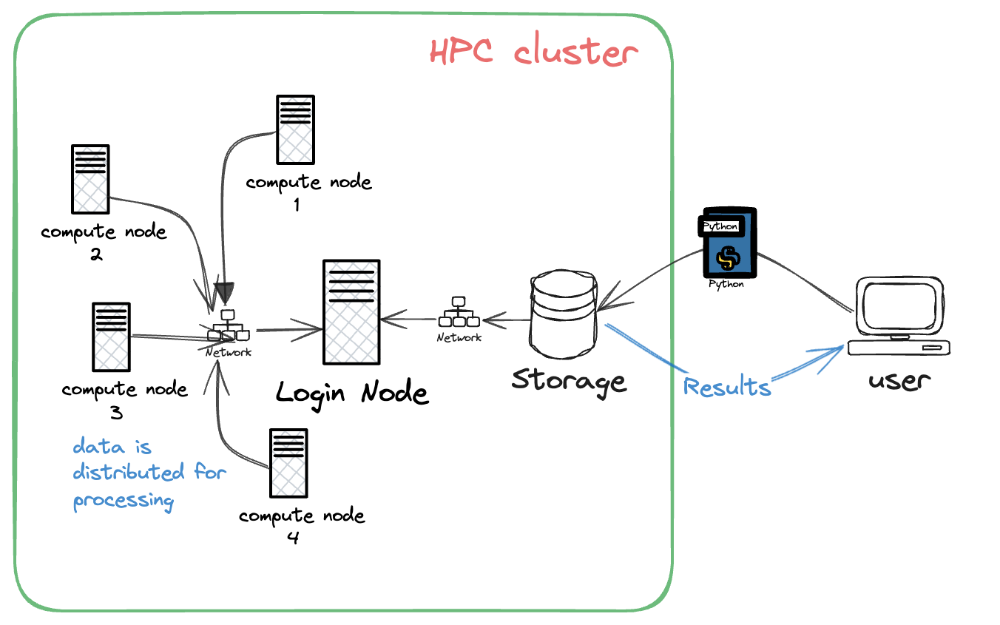

# Parallel Data Processing on a HPC Cluster (On-Going Project)

Implementing a python script to perform data processing on a HPC Cluster. 
This project  involved reading a large dataset, performing some data transformations, and writing 
the processed data back to the disk. The goal is to show case my ablity to utilize HPC reasources for efficent data processing.

# Steps Implemented in this project:

1. Prepared the Dataset:

- Reading the data in chunks to handle large files efficently. 
- Performed a simple data transformation, such as calcualting income per captia()

2. Parallel Processing: 
- The script uses the 'multiprocesing' libary to process the multiple files in parallel.

3. Job Submission - The SLURM job Script submits the data processing job to the HPC cluster, allocating
resources as specified.

# Future Implemenation

1. Setup the HPC Envirnoment
- access to HPC cluster with necessary permissions
- Loading the required modules (eg: Pythonm, SLURM)

2. Test and Validate
- Run jobs on the HPC Cluster, mointer performance, and validate the results
- Do any necessary optimizations to improve performances